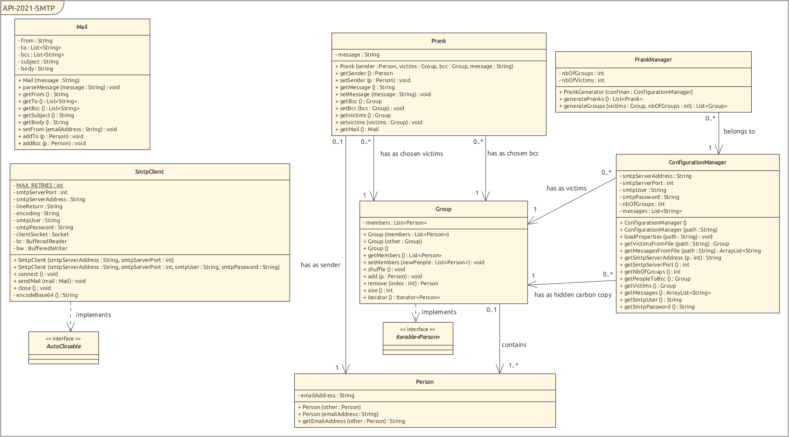

# Table of contents

- [Introduction](#introduction)
- [MockMock server](#mockmock-server)
    * [Usage](#usage)
        + [Docker Desktop](#docker-desktop)
    * [Build image locally](#build-image-locally)
- [Set up](#set-up)
    * [_config.properties_](#-configproperties-)
    * [_messages.utf8_](#-messagesutf8-)
    * [_victims.utf8_](#-victimsutf8-)
- [Implementation](#implementation)
    * [Class diagram](#class-diagram)
        + [Config](#config)
        + [Mail](#mail)
        + [Prank](#prank)
    * [Smtp](#smtp)

# Introduction

The main goal of this project was to become familiar with the SMTP protocol. We were asked by our professor to develop a client application that plays pranks on a list of victims. This app will generate a number of pranks based on properties specified in a config file, a list of messages and a list of victims. Then, the app will communicate with a SMTP server in order to send the prank e-mails to the targeted victims.

If you don't want to disturb a live SMTP server, you can use a test server 
like MockMock. It will act as a normal server, let you look at the requests 
you make, but it won't dispatch the pranks to the real e-mail addresses. So 
you can do whatever you want, it will not affect anybody.

| :warning: Disclaimer |
|:---------------------|
| We take no responsibility for damages or inconveniences caused by our program. It has been created for educational purposes and should not be used in real life. |

# MockMock server

The MockMock server being used in this project is the following : [MockMock](https://github.com/HEIGVD-Course-API/MockMock)

First make sure that Docker is installed and up and running.

The installation procedure for all the supported platforms can be found [here](https://docs.docker.com/engine/install/).

## Usage

You can use the pre-build image of MockMock available on [Docker hub](https://hub.docker.com/repository/docker/lothindir/mockmock) and built from this repo:

```
# Pull the image from docker hub
> docker pull lothindir/mockmock

# Run the container using the image
> docker run -d -p 25:25 -p 8282:8282 --name mockmock lothindir/mockmock
```
Linux users might need to use **sudo** for these commands to work.

The web interface will be available at the address `localhost:8282` and the SMTP server will be available on port `25`.

To stop the server just type:

```
> docker kill mockmock
```

### Docker Desktop

Once the image is pulled from Docker hub or built locally you can create a new container using that image. On Docker Desktop it looks like this:


## Build image locally

First you need to open a terminal in the folder containing the provided DockerFile.

Then, use `docker build -t mockmock .` to build an image named *mockmock*. This step might take a couple of minutes. 

Once it's done, use `docker run -d -p 25:25 -p 8282:8282 --name mockmock mockmock` to create a container running *mockmock* image and run it in detached mode.

# Set up

Now that you have a MockMock server running in the background you start by configuring your app. This SMTP application contains three files : _config.properties, messages.utf8, victims.utf8_.

## _config.properties_

In this file you will find the following properties :

```conf
smtpServerAddress=127.0.0.1
smtpServerPort=25
numberOfGroups=1
peopleToBCC=bob.dylan@rock.ch,michael.jackson@thriller.com
smtpUser=123username123
smtpPassword=abcpassabc
```

* `smtpServerAddress` should point to the targeted server address without the port
* `numberOfGroups` should not be greater than the number of victims divided by 3. The reason is that each group is composed by a sender and minimum two victims
* `peopleToBCC` is a list of people that will receive each prank mail sent by the program
* `smtpUser` is the username required if using plain authentication _(optional)_
* `smtpPassword` is the password required if using plain authentication _(optional)_

Feel free to edit the properties to your likings.

## _messages.utf8_

In this file you will find two templates of messages you could send. Each message starts with a subject line and ends with `----------------` (16 dashes). You can add as many messages as you like, the app will chose one and assign it to a prank.

## _victims.utf8_

This file contains the list of e-mail addresses. Be sure to have correctly formatted addresses otherwise the app won't work.

# Usage

Clone this repo and be sure to have java (jdk-11) and maven installed. Go to the project root folder and build the application using `mvn clean package`. Once the application is built you can find the jar file and the configurations files in the _target_ directory.

The app provides a way to specify where the configuration files are located. The only restriction is that they all have to be in the same folder. To specify the path to the configuration files just type

```
> mvn exec:java -Dexec.args="<path/to/conf/folder>"
or
> java -jar Spamibot-1.0.jar <path/to/conf/folder>
```

If the SMTP server is up and running and the properties are correct everything should work just fine. Enjoy sending prank mails !

# Implementation

## Class diagram



We decided to divide our project in four packages : config, mail, prank, smtp. The SpamiBot class is the entry point of the application. It creates an SMTP client with some properties from a configuration manager. Generates a list of pranks using the PrankManager and sends each custom Mail to the client.

## Config

We decided to create a ConfigurationManager class, its main goal is to fetch the configuration from the files.

## Mail

In this package you will find a Group class representing a group of person affected by the prank attack.

The Mail class stores all the information of the e-mail to send such as the 
sender's address, the subject, the body, the victims' address and the people 
to set as hidden carbon copy. Every information is stored as a String.

Person is obviously a class representing a person. It stores the e-mail 
address fetched in the files.

## Prank

Here we put the Prank class. It contains all the information regarding the prank attack (victims, group, sender). It generates a mail object with all the information it has.

Then there is the PrankManager, it simply generates groups from the list of people and creates a custom prank for each one of them.

## Smtp

The SMTP Client only task is to communicate with the SMTP server and execute the attack. It uses the SMTP protocol to send the information to the server and listens for its response.

## Example of output 
```shell
INFO: Connected to Socket[addr=localhost/127.0.0.1,port=25,localport=42698]
INFO: 220 06891e085e5a ESMTP MockMock SMTP Server version 1.4
INFO: EHLO 250-06891e085e5a
INFO: 250-8BITMIME
INFO: 250 Ok
INFO: 

INFO: Sending mail...
INFO: MAIL FROM: <boblito@twitter.fr> => 250 Ok
INFO: RCPT TO: <leroi122@gmail.com> => 250 Ok
INFO: RCPT TO: <judith@email.com> => 250 Ok
INFO: RCPT TO: <alice@heig-vd.ch> => 250 Ok
INFO: BCC TO: anthony.coke@heig-vd.ch => 250 Ok
INFO: BCC TO: francesco.monti@heig-vd.ch => 250 Ok
INFO: Writing DATA...
INFO: 250 Ok

INFO: Sending mail...
INFO: MAIL FROM: <bob@heig-vd.ch> => 250 Ok
INFO: RCPT TO: <antoine@yahoo.fr> => 250 Ok
INFO: RCPT TO: <robert@pom.dapi> => 250 Ok
INFO: BCC TO: anthony.coke@heig-vd.ch => 250 Ok
INFO: BCC TO: francesco.monti@heig-vd.ch => 250 Ok
INFO: Writing DATA...
INFO: 250 Ok

INFO: Sending mail...
INFO: MAIL FROM: <bob@gmail.com> => 250 Ok
INFO: RCPT TO: <bazar.pazivessitch@heig-vd.ch> => 250 Ok
INFO: RCPT TO: <jo.fricoli@heig-vd.ch> => 250 Ok
INFO: RCPT TO: <val.calin@heig-vd.ch> => 250 Ok
INFO: RCPT TO: <gui.mo@heig-vd.ch> => 250 Ok
INFO: BCC TO: anthony.coke@heig-vd.ch => 250 Ok
INFO: BCC TO: francesco.monti@heig-vd.ch => 250 Ok
INFO: Writing DATA...
INFO: 250 Ok

INFO: Sending mail...
INFO: MAIL FROM: <iamAHacker@com.com> => 250 Ok
INFO: RCPT TO: <jean.eustache@google.com> => 250 Ok
INFO: RCPT TO: <ma.gol@heig-vd.ch> => 250 Ok
INFO: RCPT TO: <john.doe@generic.com> => 250 Ok
INFO: RCPT TO: <alex.terieur@heig-vd.ch> => 250 Ok
INFO: BCC TO: anthony.coke@heig-vd.ch => 250 Ok
INFO: BCC TO: francesco.monti@heig-vd.ch => 250 Ok
INFO: Writing DATA...
INFO: 250 Ok

INFO: Quitting...

```